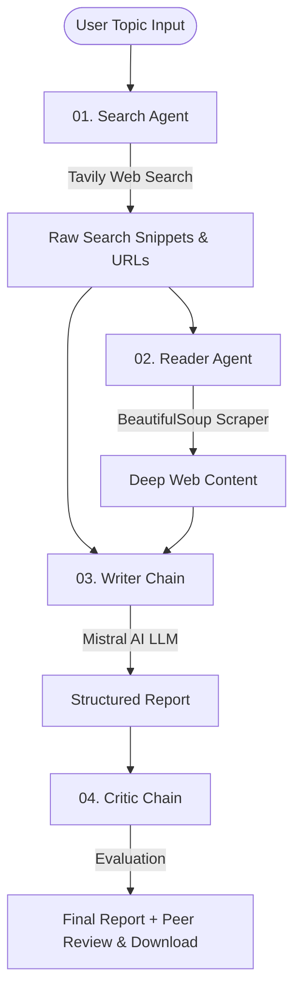

# 🔬 ResearchMind · Multi-Agent AI Research System

**ResearchMind** is an advanced, autonomous multi-agent research pipeline powered by **LangChain**, **Mistral AI**, **Tavily Web Search**, and **Streamlit**. 

Four specialized AI agents collaborate sequentially — searching the live web, scraping deep webpage content, drafting a comprehensive report, and critiquing the output — to deliver detailed research documents on any topic.

[](https://researchmind-bdwjxbdkhf7xr38wbz9ngd.streamlit.app)

---

## 🌐 Live Demo

Try the live deployed web application here:  
👉 **[https://researchmind-bdwjxbdkhf7xr38wbz9ngd.streamlit.app](https://researchmind-bdwjxbdkhf7xr38wbz9ngd.streamlit.app)**

---

## 🌟 Key Features

- 🤖 **4-Agent Collaborative Architecture:**
  1. **Search Agent (01):** Discovers top, recent web results using Tavily Search API.
  2. **Reader Agent (02):** Automatically extracts and cleans deep content from top web sources using BeautifulSoup.
  3. **Writer Chain (03):** Synthesizes research into a structured, publication-ready Markdown report.
  4. **Critic Chain (04):** Performs rigorous peer review, assigning quality scores (X/10), strengths, and recommendations.
- 🎨 **Modern Glassmorphism UI:** Built with custom dark-mode CSS, vibrant HSL gradients, high-contrast inputs, and responsive layout.
- 📊 **Real-time Pipeline Tracking:** Watch each agent progress live step-by-step (`● RUNNING` → `✓ DONE`).
- 🔍 **Raw Data Inspection:** Easily expand and view raw Tavily search snippets and scraped web articles.
- ⬇️ **Export & Download:** Download completed reports as formatted `.md` files with a single click.

---

## 🏗️ Architecture & Workflow



---

## 📁 Project Structure

```text
Multi-agent-research-system-main/
├── app.py              # Streamlit Web Interface (UI & Live State Loop)
├── agents.py           # Agent definitions (Search, Reader, Writer, Critic)
├── tools.py            # Custom tools (web_search with Tavily, scrape_url with BeautifulSoup)
├── pipeline.py         # CLI/Backend execution script
├── requirements.txt    # Python dependencies
├── .env                # Environment variables (API Keys)
└── README.md           # Documentation
```

---

## 🚀 Quick Start Guide

### 1. Prerequisites
- **Python 3.10+** (Python 3.12 recommended)
- **uv** (fast Python package manager) or standard `pip`

### 2. Environment Setup
Clone the repository and create a virtual environment:

```bash
# Create virtual environment with uv
uv venv .venv

# Activate environment (macOS/Linux)
source .venv/bin/activate

# Install dependencies
uv pip install -r requirements.txt
```

### 3. API Keys Configuration
Create a `.env` file in the root directory and add your API keys:

```env
MISTRAL_API_KEY=your_mistral_api_key_here
TAVILY_API_KEY=tvly-your_tavily_api_key_here
```

> 🔑 **Get your free keys:**
> - [Mistral AI Key](https://console.mistral.ai/) (`mistral-small-latest`)
> - [Tavily Search API Key](https://tavily.com/)

---

## ☁️ Deployment

This project is deployed on **Streamlit Community Cloud**:
- **Live URL:** [https://researchmind-bdwjxbdkhf7xr38wbz9ngd.streamlit.app](https://researchmind-bdwjxbdkhf7xr38wbz9ngd.streamlit.app)
- **Automated CI/CD:** Every commit pushed to `main` branch automatically updates the live app.

---

## 💻 Running Locally

### Option A: Interactive Web UI (Streamlit)

Launch the Streamlit app locally:

```bash
uv run streamlit run app.py
```

Open your browser at `http://localhost:8501`.

### Option B: Terminal CLI Execution

Run the research pipeline directly in terminal:

```bash
python pipeline.py
```

---

## ⚙️ Tech Stack

- **Framework:** [LangChain](https://www.langchain.com/) / LangChain Core
- **LLM Provider:** [Mistral AI](https://console.mistral.ai/) (`mistral-small-latest`)
- **Search Tool:** [Tavily Search API](https://tavily.com/)
- **Scraper:** BeautifulSoup4 & Requests
- **UI & Hosting:** Streamlit & Streamlit Community Cloud

---

## 📝 License

Distributed under the MIT License. See `LICENSE` for more information.
